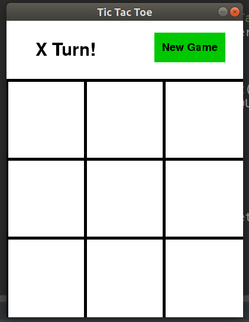
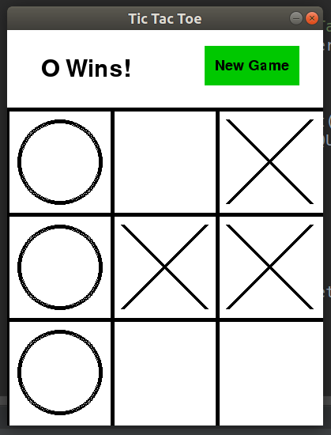

# Tic Tac Toe Python Version

## About
This is a Python implementation of the Tic Tac Toe game. The program contains an interactive GUI made using PyGame
as well as a dynamic AI Tic Tac Toe player.

## Features
Here is a list of features that the program has:
- An AI Tic Tac Toe player that can't be beaten
- Simple and colorful GUI

## Screenshots
An empty grid screenshot: 

An end game screenshot:

